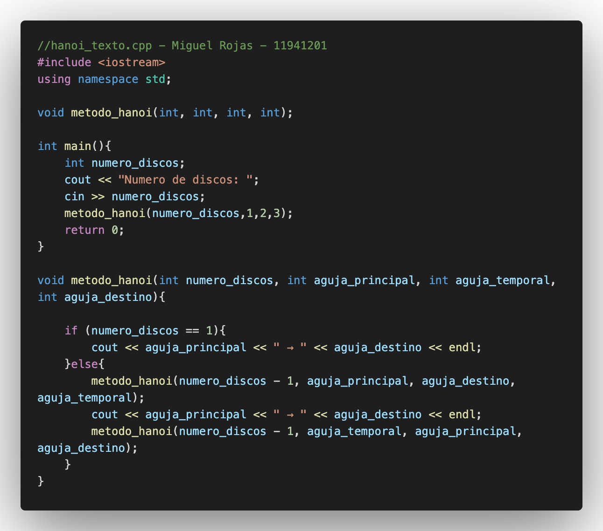
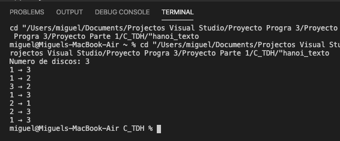

# C++ _ TDH

## :copyright: Autor

- :camera: 

- :man: **Miguel Angel Rojas Herrera**
- :e-mail: m_rojas18@unitec.edu
- :link: [github.com/m_rojas18](https://github.com/m-rojas18)
- :calendar: 09-09-2020 20:00 CST
---
## :dart: Objetivos

Un programa  de **C++** diseñado para :

1) Mostrar el problema de las torres de hanoi mediante recursividad

## :black_circle: hanoi_texto.cpp

## :red_circle: Salida:

## Descripcion 
-> El programa muestra el cambio entre la aguja principal a la aguja destino teniendo tambien una aguja temporal para sostener los cambion , y asi mostrar la serie de movimientos del problema de  las "Torres de Hanoi".

## :computer: Código
- :blue_book: [hanoi_texto.cpp] (https://github.com/m-rojas18/C_TDH.git)
#### Herramientas:
- :package: [Visual Studio Code](https://code.visualstudio.com/)
- :camera: [Polacode-2020 v0.5.2](https://github.com/jeff-hykin/polacode)
- :notebook: [Markdown Cheatsheet](https://github.com/adam-p/markdown-here/wiki/Markdown-Cheatsheet)
- :smile: [Emoji Cheat Sheet](https://www.webfx.com/tools/emoji-cheat-sheet/)
